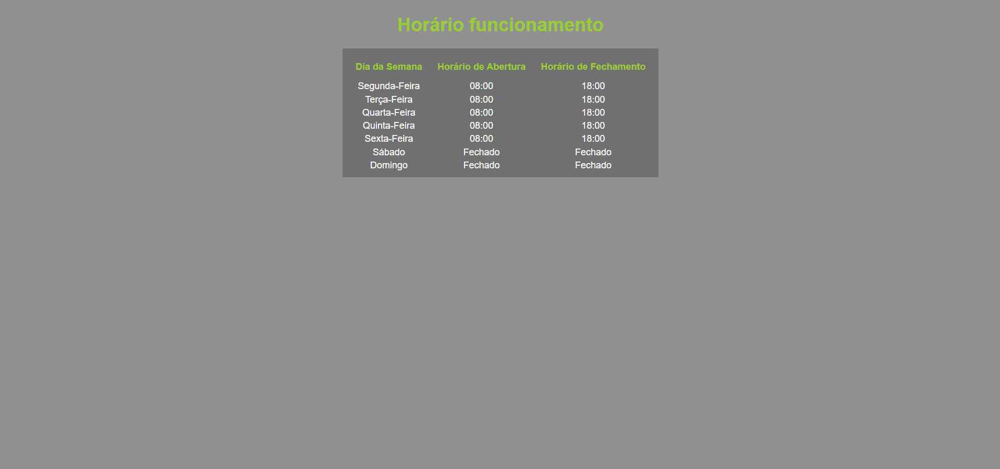

# Prova P1 Desenvolvimento Web Professor Valdir

## Desenvolvimento de uma Landing Page com o conteúdo que foi passado em aula.

### Utilizando
- Tabelas
- Formulário
- JavaScript
- HTML e CSS

## Prints da Landing Page

## Authors

Igor Enzo da Silva Kita - RA: 1992614 
GitHub - https://github.com/igorkita
